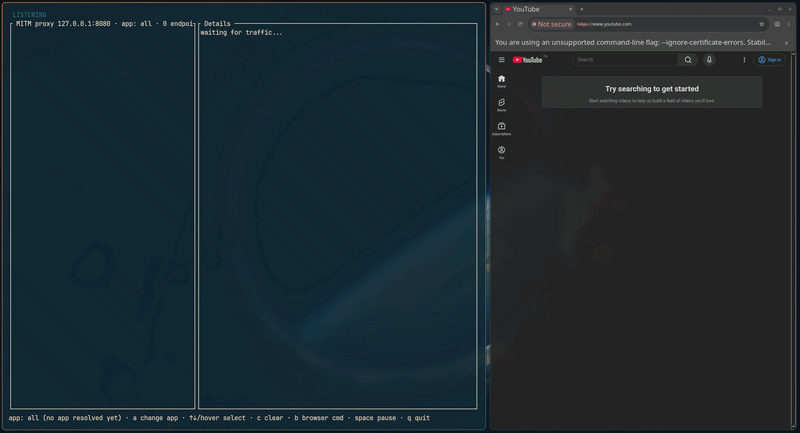
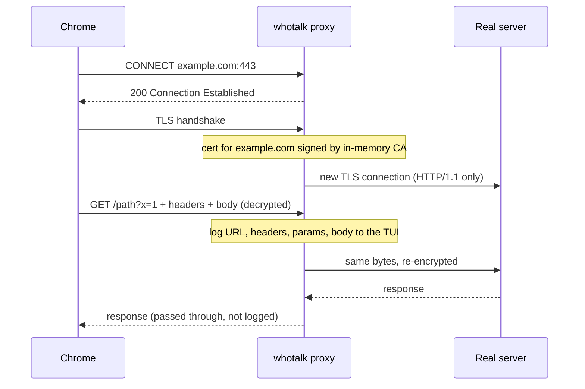
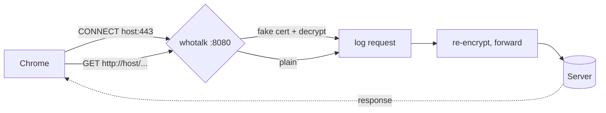

# whotalk

TUI that lists the hostnames your machine talks to, with IPs, ports, owning app, and request URLs/headers/parameters/body.

```
sudo apt install libpcap-dev
cargo build --release
sudo ./target/release/whotalk [interface]   # sniff: hostnames only (HTTPS is encrypted); no interface = pick in TUI
./target/release/whotalk --mitm             # proxy: full HTTPS URLs/headers/body, no root
```

MITM mode listens on `127.0.0.1:8080` with a throwaway in-memory CA. On start it shows a Chrome launch command (Enter copies it; `b` reopens). It uses a throwaway profile with certificate errors ignored; never point your real profile at it.

Keys: mouse hover or ↑↓ select, wheel / PgUp / PgDn scroll details, `a` cycle app filter, `c` clear data, `b` browser launch command (MITM), space pause, q quit.

Limits: sniffer sees hostnames only for HTTPS and does not parse HTTP/3 (QUIC); the proxy handles HTTPS (CONNECT) and plain `http://` over HTTP/1.1, requests only. App names come from `/proc` (Linux, best effort).


## How the proxy works with Chrome

Launch Chrome with the command whotalk prints:

```
google-chrome --proxy-server=127.0.0.1:8080 --ignore-certificate-errors --user-data-dir=/tmp/whotalk-chrome
```

- `--proxy-server` sends all Chrome traffic to whotalk.
- `--ignore-certificate-errors` lets Chrome accept whotalk's fake certificates. Without it every HTTPS site fails. Browser never trusts the CA, so nothing is installed system-wide.
- `--user-data-dir` is a throwaway profile, so your real cookies and logins are untouched.



Plain `http://` requests skip the TLS steps: whotalk reads the request, logs it, and forwards it as is.



Known failures: sites behind bot protection (e.g. Akamai) may reject the proxy's upstream TLS fingerprint, certificate-pinned apps ignore the fake cert, and sites that require HTTP/2 are forced down to HTTP/1.1.
